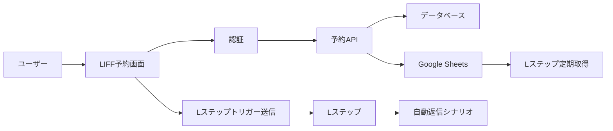

# LIFF認証 × Lステップ連携ガイド

## 📱 LIFF認証とLステップの併用

### ✅ 問題ない理由

1. **異なるレイヤーで動作**
   - LIFF: ブラウザ内での認証・UI表示
   - Lステップ: メッセージ送受信の自動化
   - 両者は干渉しない

2. **相互補完的な関係**
   - LIFF: リッチなWeb UI提供
   - Lステップ: 自動返信・シナリオ配信

## 🔄 連携パターン

### パターン1: LIFF → Lステップトリガー

```typescript
// LIFF内でのアクション後、Lステップシナリオを開始
async function completeBookingInLIFF() {
  try {
    // 1. LIFF認証情報を取得
    const profile = await liff.getProfile()
    const lineId = profile.userId
    
    // 2. 予約処理を実行
    const booking = await createBooking({
      lineId,
      program: selectedProgram,
      date: selectedDate
    })
    
    // 3. LIFFからLステップトリガーメッセージを送信
    await liff.sendMessages([{
      type: 'text',
      text: `#LIFF_BOOKING_COMPLETE_${booking.id}`
    }])
    
    // 4. LIFF画面を閉じる
    liff.closeWindow()
    
  } catch (error) {
    console.error('LIFF予約エラー:', error)
  }
}
```

### パターン2: Lステップ → LIFF誘導

```javascript
// Lステップのリッチメニューボタン設定
{
  "type": "uri",
  "label": "予約する",
  "uri": "https://liff.line.me/YOUR_LIFF_ID",
  "altUri": {
    "desktop": "https://your-domain.com/booking"
  }
}
```

## 🎯 実装例: LIFF予約 × Lステップ自動返信

### 1. LIFF予約画面（components/liff/BookingForm.tsx）
```typescript
import { useState, useEffect } from 'react'
import liff from '@line/liff'

export function LIFFBookingForm() {
  const [profile, setProfile] = useState(null)
  const [isSubmitting, setIsSubmitting] = useState(false)
  
  useEffect(() => {
    initializeLiff()
  }, [])
  
  async function initializeLiff() {
    try {
      await liff.init({ liffId: process.env.NEXT_PUBLIC_LIFF_ID })
      
      if (!liff.isLoggedIn()) {
        liff.login()
        return
      }
      
      const profile = await liff.getProfile()
      setProfile(profile)
      
    } catch (error) {
      console.error('LIFF初期化エラー:', error)
    }
  }
  
  async function handleSubmit(formData) {
    setIsSubmitting(true)
    
    try {
      // 1. バックエンドに予約リクエスト
      const response = await fetch('/api/liff/booking', {
        method: 'POST',
        headers: {
          'Content-Type': 'application/json',
          'Authorization': `Bearer ${liff.getAccessToken()}`
        },
        body: JSON.stringify({
          ...formData,
          lineId: profile.userId,
          lineName: profile.displayName
        })
      })
      
      const booking = await response.json()
      
      // 2. Lステップトリガーを送信（見えないメッセージ）
      await sendLstepTrigger(booking)
      
      // 3. 完了メッセージ表示
      alert('予約が完了しました！')
      
      // 4. LIFFを閉じる
      setTimeout(() => {
        liff.closeWindow()
      }, 2000)
      
    } catch (error) {
      console.error('予約エラー:', error)
      alert('予約に失敗しました')
    } finally {
      setIsSubmitting(false)
    }
  }
  
  async function sendLstepTrigger(booking) {
    // Lステップが検出する特殊メッセージ
    const triggerMessage = {
      type: 'text',
      text: `#LIFF_BOOKING_${booking.id}_${booking.program}_${booking.date}`
    }
    
    // LIFF経由でメッセージ送信（ユーザーには見えない）
    if (liff.isApiAvailable('sendMessages')) {
      await liff.sendMessages([triggerMessage])
    }
  }
  
  return (
    <div className="liff-booking-form">
      {profile && (
        <div className="user-info">
          
          <p>{profile.displayName}様</p>
        </div>
      )}
      
      <form onSubmit={handleSubmit}>
        {/* 予約フォーム */}
      </form>
    </div>
  )
}
```

### 2. バックエンドAPI（app/api/liff/booking/route.ts）
```typescript
import { NextRequest, NextResponse } from 'next/server'
import jwt from 'jsonwebtoken'

export async function POST(request: NextRequest) {
  try {
    // 1. LIFFトークンを検証
    const token = request.headers.get('Authorization')?.split(' ')[1]
    if (!token) {
      return NextResponse.json({ error: 'Unauthorized' }, { status: 401 })
    }
    
    // LINEのトークン検証
    const decodedToken = await verifyLIFFToken(token)
    
    // 2. 予約処理
    const bookingData = await request.json()
    const booking = await createBooking({
      ...bookingData,
      lineUserId: decodedToken.sub
    })
    
    // 3. Google Sheetsに記録（Lステップ連携用）
    await recordToGoogleSheets({
      action: 'LIFF_BOOKING',
      lineId: bookingData.lineId,
      bookingId: booking.id,
      program: bookingData.program,
      timestamp: new Date()
    })
    
    return NextResponse.json({
      success: true,
      booking
    })
    
  } catch (error) {
    console.error('LIFF予約エラー:', error)
    return NextResponse.json(
      { error: 'Booking failed' },
      { status: 500 }
    )
  }
}
```

### 3. Lステップ側の設定

#### キーワード応答設定
```
キーワード: #LIFF_BOOKING_
アクション:
  1. タグ付与「LIFF経由予約」
  2. カスタムフィールド更新
     - 最新予約ID: {抽出: 予約ID}
     - 予約プログラム: {抽出: プログラム名}
  3. シナリオ開始「予約完了フロー」
```

#### シナリオ例
```
予約完了フロー:
  1. 即時: 予約確認メッセージ
  2. 24時間前: リマインダー
  3. 終了後1時間: アンケート送信
  4. 3日後: 次回予約の案内
```

## 🔐 セキュリティ考慮事項

### 1. LIFF認証の確認
```typescript
// LIFF内でログイン状態を確認
if (!liff.isLoggedIn()) {
  liff.login({ redirectUri: window.location.href })
  return
}
```

### 2. トークン検証
```typescript
// バックエンドでLIFFトークンを検証
async function verifyLIFFToken(token: string) {
  const response = await fetch('https://api.line.me/oauth2/v2.1/verify', {
    method: 'POST',
    headers: { 'Content-Type': 'application/x-www-form-urlencoded' },
    body: `id_token=${token}&client_id=${process.env.LINE_CHANNEL_ID}`
  })
  
  if (!response.ok) {
    throw new Error('Invalid token')
  }
  
  return response.json()
}
```

### 3. Lステップトリガーの保護
```typescript
// 予約IDにハッシュを含めて偽装を防ぐ
const secureBookingId = `${booking.id}_${generateHash(booking.id, lineId)}`
const trigger = `#LIFF_BOOKING_${secureBookingId}`
```

## 📊 データフロー



## ✨ メリット

1. **シームレスな体験**
   - LIFF: 直感的な予約UI
   - Lステップ: 自動フォローアップ

2. **データ連携**
   - LIFF認証情報とLステップ顧客データの紐付け
   - 行動履歴の一元管理

3. **高度な自動化**
   - LIFF操作をトリガーにしたシナリオ配信
   - パーソナライズされた通知

## 🚀 応用例

### 1. 会員ランク連携
```typescript
// LIFF内で会員ランクを表示
const memberRank = await getMemberRank(profile.userId)

// Lステップに会員ランクを送信
await liff.sendMessages([{
  type: 'text',
  text: `#UPDATE_RANK_${memberRank}`
}])
```

### 2. ポイント連携
```typescript
// 予約完了時にポイント付与
const points = calculatePoints(booking)

// Lステップ経由でポイント通知
await sendLstepTrigger(`#POINTS_ADDED_${points}`)
```

### 3. アンケート連携
```typescript
// LIFFアンケート回答後
const surveyResult = await submitSurvey(formData)

// Lステップでフォローアップ
await sendLstepTrigger(`#SURVEY_COMPLETE_${surveyResult.satisfaction}`)
```

## 🎯 まとめ

LIFF認証とLステップは完全に併用可能で、むしろ組み合わせることで：
- リッチなUIと高度な自動化の両立
- シームレスなユーザー体験
- 詳細な行動分析とパーソナライゼーション

が実現できます！