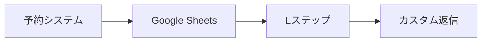

# LステップAPI非公開時の連携パターン

## 📊 実際の連携フロー

### ❌ 直接API連携（APIキーが必要）
```
予約システム → Lステップ API → LINE
```

### ✅ Webhook経由の連携（APIキー不要）
```
予約システム → LINE Webhook → 公式LINE → Lステップ → ユーザー
```

## 🔄 具体的な実装方法

### 1. 公式LINE Webhookで情報を受け取る

```typescript
// app/api/webhook/line/route.ts
export async function POST(request: NextRequest) {
  const body = await request.json()
  const events = body.events
  
  for (const event of events) {
    if (event.type === 'message') {
      // メッセージ内容を解析
      const userMessage = event.message.text
      const userId = event.source.userId
      const replyToken = event.replyToken
      
      // カスタムキーワードで予約情報を埋め込む
      if (userMessage.includes('#予約完了')) {
        // Lステップ側で「#予約完了」を検出して
        // 自動返信シナリオを開始
      }
    }
  }
}
```

### 2. 特殊なメッセージフォーマットで情報連携

```typescript
// 予約完了時に公式LINEで特殊フォーマットのメッセージを送信
async function sendBookingInfoToLstep(booking: any) {
  const lineClient = new LineMessagingClient()
  
  // Lステップが解析できる特殊フォーマット
  const message = {
    type: 'text',
    text: `【予約情報】
#予約ID:${booking.id}
#顧客名:${booking.customerName}
#プログラム:${booking.program}
#日時:${booking.date} ${booking.time}
#LINEID:${booking.lineId}
【予約情報終了】`
  }
  
  // 公式LINEで送信（Lステップが検出）
  await lineClient.pushMessage(booking.lineId, message)
}
```

## 🎯 Lステップ側の設定

### 1. キーワード応答設定
```
キーワード: #予約完了
アクション: 
  - タグ付与「予約済み」
  - シナリオ開始「予約確認フロー」
  - カスタムフィールド更新
```

### 2. 正規表現での情報抽出
```
パターン: #予約ID:(\d+)
抽出先: カスタムフィールド「最新予約ID」

パターン: #プログラム:(.+)
抽出先: タグ付与「{プログラム名}予約」
```

## 🔧 より高度な連携方法

### 方法1: Postbackデータの活用

```typescript
// リッチメニューやボタンにデータを埋め込む
const confirmButton = {
  type: 'template',
  altText: '予約確認',
  template: {
    type: 'buttons',
    text: '予約が完了しました',
    actions: [{
      type: 'postback',
      label: '詳細を見る',
      data: `action=view_booking&id=${booking.id}&program=${booking.program}`,
      displayText: '予約詳細'
    }]
  }
}

// Lステップ側でpostbackデータを解析して処理
```

### 方法2: Google Sheets経由の連携



```typescript
// 予約情報をGoogle Sheetsに記録
async function saveToSheets(booking: any) {
  const sheets = new GoogleSheetsClient()
  await sheets.addRow({
    予約ID: booking.id,
    LINE_ID: booking.lineId,
    ステータス: '予約完了',
    タイムスタンプ: new Date()
  })
}

// Lステップ側でGoogle Sheetsを定期的に参照
```

### 方法3: LIFF（LINE Front-end Framework）活用

```typescript
// LIFFアプリ内で予約完了
async function completeBookingInLIFF() {
  const liff = window.liff
  
  // 予約完了メッセージを送信
  await liff.sendMessages([{
    type: 'text',
    text: `#BOOKING_COMPLETE:${JSON.stringify({
      id: booking.id,
      program: booking.program,
      date: booking.date
    })}`
  }])
  
  // LIFFを閉じる
  liff.closeWindow()
}
```

## 📋 実装例：予約完了フロー

### 1. 予約システム側
```typescript
// app/api/reservations/route.ts
export async function POST(request: NextRequest) {
  // 予約処理...
  
  // 公式LINE経由でLステップに情報送信
  const lineMessage = {
    type: 'flex',
    altText: '予約完了',
    contents: {
      type: 'bubble',
      body: {
        type: 'box',
        layout: 'vertical',
        contents: [
          {
            type: 'text',
            text: '予約が完了しました',
            weight: 'bold',
            size: 'xl'
          },
          {
            type: 'text',
            text: `#RES_${reservation.id}`, // Lステップが検出
            size: 'xs',
            color: '#ffffff' // 見えないように白色
          }
        ]
      },
      footer: {
        type: 'box',
        layout: 'vertical',
        contents: [{
          type: 'button',
          action: {
            type: 'postback',
            label: '予約内容を確認',
            data: `lstep_trigger=booking_confirm&res_id=${reservation.id}`
          }
        }]
      }
    }
  }
  
  await lineClient.pushMessage(customer.line_id, lineMessage)
}
```

### 2. Lステップ側の設定
- **キーワード検出**: `#RES_` を含むメッセージ
- **アクション**: 
  - 予約IDを抽出してカスタムフィールドに保存
  - 「予約確認シナリオ」を開始
  - 24時間後にリマインダー送信

## 🎨 メリット・デメリット

### メリット
- LステップのAPIキー不要
- 公式LINEの機能をフル活用
- Lステップの高度な自動化機能を利用可能

### デメリット
- 情報連携が間接的
- リアルタイム性がやや劣る
- 実装がやや複雑

## 💡 推奨パターン

### 小規模運用
```
公式LINE Messaging API のみで運用
```

### 中規模運用
```
公式LINE → Lステップ（キーワード連携）
```

### 大規模運用
```
予約システム → Google Sheets → Lステップ
または
LIFF → Lステップ（postback連携）
```

この方法により、LステップのAPIキーがなくても、公式LINEを経由して効果的な連携が可能です！